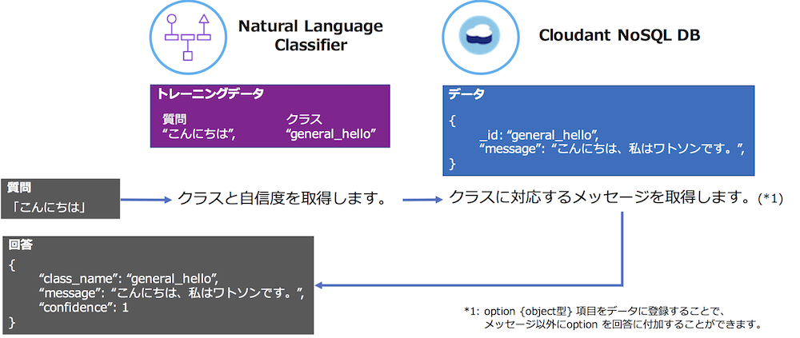

# watson-nlc-qa

[](https://nodei.co/npm/watson-nlc-qa/)

[](https://travis-ci.org/ippei0605/watson-nlc-qa)
[](https://codecov.io/gh/ippei0605/watson-nlc-qa)

## はじめに
Q&A Chatbot を作成するためのモデルです。

### コンセプト


### 使い方
```javascript
const QaModel = require('watson-nlc-qa');
const qa = new QaModel(cloudantCreds, 'answer', nlcCreds);
qa.ask('こんにちは', (answer) => {
    console.log('answer:', answer);
});
```

### システム要件
次のサービスを使用してください。
* IBM Bluemix
  - [Cloudant NoSQL DB](https://console.bluemix.net/catalog/services/cloudant-nosql-db?locale=ja)
  - [Watson Natural Language Classifier](https://console.bluemix.net/catalog/services/natural-language-classifier?locale=ja)
* Node.js
  - 6 以上

### インストール
```
$ npm install watson-nlc-qa
```

### 参考情報
* このモデルを使用した Q&A Chatbot をこちらに開発しました。
  - https://github.com/ippei0605/qa-chatbot

---
<a name="table-of-contents"></a>
## 目次
* [APIs](#apis)
    * [QaModel(cloudantCreds, dbname, nlcCreds, [classifierid])](#qamodelcloudantcreds-dbname-nlccreds-classifierid)
    * [ask(text, callback)](#asktext-callback)
    * [askAnswers(text, count, callback)](#asktext-count-callback)
    * [askClassName(text, callback)](#askclassnametext-callback)
    * [getAppSettings(callback)](#getappsettingscallback)
    * [createDatabase([callback])](#createdatabasecallback)
    * [insertDesignDocument([mapFunction], [callback])](#insertdesigndocumentmapfunction-callback)
    * [insertDocuments(data, [callback])](#insertdocumentsdata-callback)
    * [train(file, metadata, [mode], [callback])](#trainfile-metadata-mode-callback)
* [Tips](#tips)
    * [データを初期登録する](#tips-1)
    * [取得した回答を変更する](#tips-2)
    * [Natural Language Classifier を多段構成にする](#tips-3)

---

## APIs

### QaModel(cloudantCreds, dbname, nlcCreds, [classifierid])
Q&A モデルを生成します。
```javascript
const QaModel = require('watson-nlc-qa');
const qa = new QaModel(cloudantCreds, 'answer', nlcCreds);
```

|パラメータ     |必須  |型      |説明                                                 |
| ------------ | --- | ------ | -------------------------------------------------- |
|cloudantCreds |Yes  |object  |Cloudant NoSQL DB のサービス資格情報                  |
|dbName        |Yes  |string  |データベース名                                        |
|nlcCreds      |Yes  |object  |Natural Language Classifier のサービス資格情報        |
|classifierId  |No   |string  |Classifier ID。未設定または空文字の場合は使用可能な最新の Classifier を選択します。|

* cloudantCreds {object} Cloudant NoSQL DB のサービス資格情報

    ```json
    {
        "username": "{username}",
        "password": "{password}",
        "host": "{host}",
        "port": 443,
        "url": "{url}"
    }
    ```
    
* nlcCreds {object} Natural Language Classifier のサービス資格情報

    ```json
    {
        "url": "{url}",
        "username": "{username}",
        "password": "{password}"
    }
    ```

[目次に戻る](#table-of-contents)

---

### ask(text, callback)
テキスト分類で回答 answer を取得します。
```javascript
qa.ask('こんにちは', (answer) => {
    console.log(answer);
});
```

|パラメータ     |必須  |型       |説明                                                 |
| ------------ | --- | ------- | --------------------------------------------------- |
|text          |Yes  |string   |質問                                                 |
|callback      |Yes  |function |取得した回答 answer を引数にコールバックする。           |

* 回答 answer
```json
{
  "class_name": "{string} クラス名",
  "message": "{string} メッセージ",
  "confidence": "{number} 自信度"
}
```

[目次に戻る](#table-of-contents)

---

### askAnswers(text, count, callback)
テキスト分類で回答配列 [answer] を取得します。取得する回答件数は1から10までの整数で指定できます。回答件数が1件の場合は回答 (配列ではない) を取得します。
```javascript
qa.askAnswers('こんにちは', 10, (answers) => {
    console.log(answers);
});
```

|パラメータ     |必須  |型       |説明                                                 |
| ------------ | --- | ------- | --------------------------------------------------- |
|text          |Yes  |string   |質問                                                 |
|count         |Yes  |number   |取得する回答件数 (1〜10)                               |
|callback      |Yes  |function |取得した回答 answer を引数にコールバックする。           |

* 回答 answer
```json
{
  "class_name": "{string} クラス名",
  "message": "{string} メッセージ",
  "confidence": "{number} 自信度"
}
```

[目次に戻る](#table-of-contents)

---

### askClassName(text, callback)
クラス名により回答 answer を取得します。
```javascript
qa.askClassName('general_hello', (answer) => {
    console.log(answer);
});
```

|パラメータ     |必須  |型       |説明                                                 |
| ------------ | --- | ------- | --------------------------------------------------- |
|text          |Yes  |string   |クラス名                                              |
|callback      |Yes  |function |取得した回答 answer を引数にコールバックします。          |

[目次に戻る](#table-of-contents)

---

### getAppSettings(callback)
アプリケーション設定 value を取得します。
```javascript
qa.getAppSettings((value) => {
    console.log(value);
});
```

|パラメータ     |必須  |型       |説明                                                          |
| ------------ | --- | ------- | ----------------------------------------------------------- |
|callback      |Yes  |function |取得したアプリケーション設定 value を引数にコールバックします。     |

* アプリケーション設定 value
```json
{
  "name": "名前"
}
```
> ID「app_settings」でデータベースに登録した文書をそのまま取得できます。

[目次に戻る](#table-of-contents)

---

### createDatabase([callback])
データベースを作成します。
```javascript
qa.createDatabase((result)=>{
    console.log(result);
});
```

|パラメータ     |必須  |型       |説明                                                          |
| ------------ | --- | ------- | ----------------------------------------------------------- |
|callback      |No   |function |取得した結果 result を引数にコールバックします。                  |

[目次に戻る](#table-of-contents)

---

### insertDesignDocument([mapFunction], [callback])
データベースに設計文書を登録します。
```javascript
qa.insertDesignDocument('', (result) => {
    console.log(result);
});
```

|パラメータ     |必須  |型       |説明                                                          |
| ------------ | --- | ------- | ----------------------------------------------------------- |
|mapFunction   |No   |string   |マップファンクション。未設定または空文字の場合はデフォルトのマップファンクションで設計文書を作成します。|
|callback      |No   |function |取得した結果 result を引数にコールバックします。                  |

* 設計文書

    ```json
    {
        "_id": "_design/answers",
        "views": {
            "list": {
                "map": "{マップファンクション}"
            }
        }
    }
    ```
    
* デフォルトのマップファンクション

    ```javascript
    const MAP_FUNCTION = `function (doc) {
        if (doc._id !== 'app_settings') {
            var row = {
                "_id": doc._id,
                "_rev": doc._rev,
                "message": doc.message,
                "questions": doc.questions
            };
            emit(doc._id, row);
        }
    }`;
    ```

[目次に戻る](#table-of-contents)

---

### insertDocuments(data, [callback])
データを登録します。
```javascript
qa.insertDocuments(data, (result) => {
    console.log(result);
});
```

|パラメータ     |必須  |型       |説明                                                          |
| ------------ | --- | ------- | ----------------------------------------------------------- |
|data          |Yes  |object   |データ                                                        |
|callback      |No   |function |取得した結果 result を引数にコールバックします。                  |


* データ

    ```json
    {
      "docs": [
        {
          "_id": "app_settings",
          "name": "Watson Diet Trainer"
        },
        {
          "_id": "general_hello",
          "message": "こんにちは。私はワトソンです。",
          "questions": [
            "こんばんは。",
            "はじめまして。",
            "はじめまして。こんにちは。 ",
            "こんにちは。",
            "よろしくお願いします。",
            "おはようございます。"
          ]
        }
      ]
    }
    ```

[目次に戻る](#table-of-contents)

---

### train(file, metadata, [mode], [callback])
Classifier を作成します。

```javascript
const trainingFile = fs.createReadStream(__dirname + '/classifier.csv');
const metadata = {
    "language": "ja",
    "name": "My Classifier"
};
qa.train(trainingFile, metadata, false, (result) => {
    console.log(result);
});
```

|パラメータ     |必須  |型       |説明                                                          |
| ------------ | --- | ------- | ----------------------------------------------------------- |
|file          |Yes  |file     |トレーニング CSV ファイル                                       |
|metadata      |Yes  |object   |トレーニングメタデータ                                          |
|mode          |No   |boolean  |true: Classifier を作成します / false: Classifier が一つ以上ある場合は作成しません。|
|callback      |No   |function |取得した結果 result を引数にコールバックします。                  |

* トレーニング CSV ファイル

    ```
    "こんにちは。","general_hello"
    "間違っています。","general_sorry"
    "ありがとう。","general_thanks"
    "自己紹介して。","general_whoareyou"
    ```

* トレーニングメタデータ

    ```json
    {
        "language": "ja",
        "name": "{Classifier 名}"
    }
    ```

[目次に戻る](#table-of-contents)

---

## Tips

<a name="tips-1"></a>
### データを初期登録する
データベース作成、設計文書登録、データ登録は個別にも実行できますが、次のようにすることでデータベース作成後に設計文書登録とデータ登録を実行できます。

```javascript
// データベースを作成する。
qa.createDatabase(() => {
    // 設計文書を作成する。
    qa.insertDesignDocument();
    // データを登録する。
    const data = fs.readFileSync(__dirname + '/' + CONTENT_FILENAME).toString();
    qa.insertDocuments(JSON.parse(data));
});
```

[目次に戻る](#table-of-contents)

---
<a name="tips-2"></a>
### 取得した回答を変更する
ask メソッドで取得した回答を条件によって変更したい場合は、コールバックに処理を記述することで実現できます。
以下は現在時刻 now によりあいさつを「おはようございます」、「こんにちは」、「こんばんは」、「お疲れ様です」に変更する例です。

```javascript
// Q&A モデルを作成する。
const qa = new QaModel(context.cloudantCreds, context.DB_NAME, context.nlcCreds);
// こんにちはを変換する。
const replaceHello = (text, replaceText) => {
    return text.replace(/こんにちは/g, replaceText);
};
// 条件により回答を確定する。
const modify = (answer, now) => {
    switch (answer.class_name) {
        case 'general_hello':
            let regexp = /(\d+)年(\d+)月(\d+)日 (\d+)時(\d+)分(\d+)秒/;
            let hour = parseInt(regexp.exec(now)[4], 10);
            if (hour >= 17) {
                answer.message = replaceHello(value.message, 'こんばんは');
            } else if (hour < 11 && hour >= 5) {
                answer.message = replaceHello(value.message, 'おはようございます');
            } else if (hour < 5) {
                answer.message = replaceHello(value.message, 'お疲れ様です');
            }
            break;
        default:
            break;
    }
    return answer;
};
// 質問する。
const text = 'こんにちは';
qa.ask(text, (answer) => {
    const now = '2017年7月29日 14時26分44秒';
    console.log(modify(answer, now));
});
```

[目次に戻る](#table-of-contents)

---
<a name="tips-3"></a>
### Natural Language Classifier を多段構成にする
次のように、連想配列に必要なQ&Aモデルを生成してください。この例は、classification で切り分け、general または diet に問合せる構成です。

```javascript
const qa = {
    "classification": new QaModel(cloudantCreds, 'classification', nlcCreds, '{classification の Classifier ID}'),
    "general": new QaModel(cloudantCreds, 'general', nlcCreds, '{general の Classifier ID}'),
    "diet": new QaModel(cloudantCreds, 'diet', nlcCreds, '{diet の Classifier ID}')
};
const text = 'こんにちは';
qa["classification"].ask(text, (classification) => {
    qa[classification.message].ask(text, (answer) => {
        console.log(answer);
    })
});
```

classification の回答 answer は質問により general または diet が返るようにデータ登録とトレーニングをしてください。

* データの例

    ```json
        {
          "docs": [
            {
              "_id": "general",
              "message": "general"
            },
            {
              "_id": "diet",
              "message": "diet"
            }
          ]
        }
    ```

* トレーニングデータ (csv) の例

    ```
    "こんにちは。","general"
    "ありがとう。","general"
    "全身運動でダイエットしたい。","diet"
    "小顔になりたい。","diet"
    ```

[目次に戻る](#table-of-contents)

---
